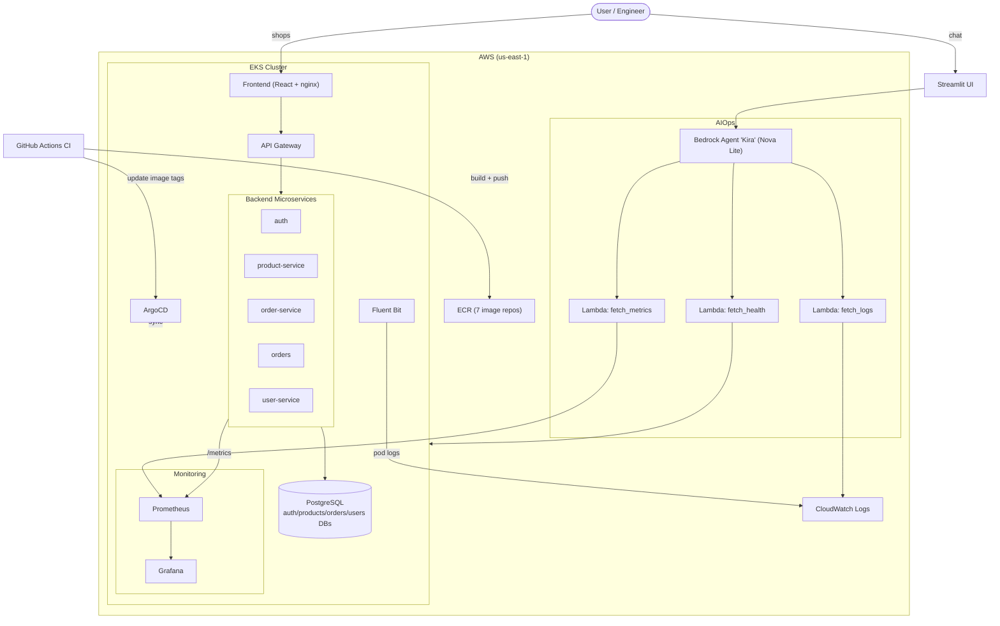

# Enterprise CloudOps AI Platform

An end-to-end **DevOps + AIOps** platform: a seven-service e-commerce microservices
application deployed on **AWS EKS**, provisioned with **Terraform**, delivered through a
**GitHub Actions** CI/CD pipeline and **ArgoCD** GitOps, observed with
**Prometheus + Grafana**, and operated by an **AI incident-diagnosis assistant ("Kira")**
built on **AWS Bedrock**.

This repository is a hands-on implementation that takes an application from a local
Docker Compose setup all the way to a self-healing, observable, AI-assisted production
platform on Kubernetes.

---

## What this project demonstrates

- **Infrastructure as Code** — entire AWS footprint (VPC, EKS, node groups, ECR, IAM, add-ons) defined in modular Terraform.
- **Container orchestration** — microservices packaged as Docker images and run on a managed Kubernetes (EKS) cluster.
- **CI/CD** — GitHub Actions builds and pushes seven service images to ECR in parallel and updates the deployment manifests.
- **GitOps** — ArgoCD continuously reconciles the cluster to the Git-declared state (self-healing, drift detection).
- **Observability** — every service exposes `/metrics`; Prometheus scrapes them, Grafana visualises them, Fluent Bit ships logs to CloudWatch.
- **AIOps** — a Bedrock agent answers natural-language questions ("are any services down?") by calling Lambda tools that read live logs, metrics, and cluster health, then returns a root-cause diagnosis.

---

## Architecture



---

## Tech stack

| Layer | Technology |
|-------|-----------|
| Application | React, Node.js / TypeScript, PostgreSQL |
| Containers | Docker, Docker Compose |
| Orchestration | Kubernetes (AWS EKS 1.34) |
| Infrastructure | Terraform (modular: VPC, EKS, ECR, ArgoCD) |
| CI/CD | GitHub Actions (parallel matrix build) |
| Registry | Amazon ECR |
| GitOps | ArgoCD + Kustomize |
| Metrics | Prometheus (kube-prometheus-stack) |
| Dashboards | Grafana |
| Log forwarding | AWS Fluent Bit → CloudWatch |
| AIOps | AWS Bedrock Agent (Amazon Nova Lite) + Lambda action groups |
| AI UI | Streamlit |

---

## Repository structure

```
enterprise-cloudops-ai-platform/
├── projects/
│   ├── README.md                  # Full step-by-step deployment guide
│   ├── boutique-microservices/    # The application (7 services + Postgres)
│   ├── Infrastructure/            # Terraform modules for AWS / EKS
│   └── aiops-assistant/           # Bedrock agent "Kira", Lambdas, Streamlit UI
├── gitops/
│   ├── argo-cd.yml                # ArgoCD Application manifest
│   ├── kustomization.yml          # Kustomize entry point
│   └── k8s/                       # Deployments, Services, StatefulSet, ServiceMonitor
├── docs/
│   └── PROJECT-DEEP-DIVE.md       # Detailed walkthrough + interview prep
└── .github/workflows/ci.yml       # CI pipeline (build → push → update manifests)
```

---

## How it works (by layer)

**Application.** Seven services — a React frontend, an API gateway, and `auth`,
`product-service`, `order-service`, `orders`, and `user-service` — backed by PostgreSQL.
Each service owns its own database (the microservices data-ownership pattern); the
gateway is the single entry point and routes requests to the right service.

**Build & ship.** A push to `main` triggers GitHub Actions, which builds all seven
images in parallel (a matrix job) and pushes them to ECR, then rewrites the image tags
in `gitops/k8s/` to the new commit SHA.

**Deliver.** ArgoCD watches `gitops/` and reconciles the cluster to match Git. Manual
changes (e.g. deleting or scaling a deployment) are detected as drift and — with
self-heal enabled — reverted automatically.

**Observe.** Every backend exposes a `/metrics` endpoint; a `ServiceMonitor` tells
Prometheus to scrape them. Grafana ships with a pre-loaded dashboard (request rate,
latency, error rate, CPU/memory, pod restarts, service health). Fluent Bit runs as a
DaemonSet and forwards pod logs to CloudWatch.

**Diagnose with AI.** "Kira" is a Bedrock agent that reasons like an SRE. When asked a
question, it decides which tools to call — three Lambda functions that read CloudWatch
logs, Prometheus metrics, and EKS/cluster health — correlates the results, and returns a
root cause plus remediation steps. A Streamlit chat UI sits on top.

---

## Deploy it yourself

Full instructions are in [`projects/README.md`](projects/README.md). High level:

1. **Local:** build the React frontend, then `docker compose up -d --build` in `projects/boutique-microservices/`.
2. **Infra:** `terraform init && terraform apply` in `projects/Infrastructure/` (creates VPC, EKS, ECR, ArgoCD, monitoring).
3. **Images:** run the GitHub Actions pipeline (or build/push manually) to populate ECR.
4. **Deploy:** `kubectl apply -k gitops/`, then run the DB restore job.
5. **GitOps:** `kubectl apply -f gitops/argo-cd.yml -n argocd`.
6. **AIOps (optional):** install Fluent Bit, deploy the three Lambdas + Bedrock agent (`projects/aiops-assistant/`), run the Streamlit UI.

> ⚠️ **Cost:** EKS, an on-demand node, and a LoadBalancer bill hourly. Run
> `terraform destroy` and remove the LoadBalancer / Bedrock / Lambda resources when done.

---

## Screenshots

> _Add your captured screenshots here._

| | |
|---|---|
| Storefront | _`docs/img/storefront.png`_ |
| Grafana dashboard | _`docs/img/grafana.png`_ |
| Prometheus targets | _`docs/img/prometheus.png`_ |
| Kira diagnosing a down service | _`docs/img/kira-diagnosis.png`_ |

---

## Troubleshooting & lessons learned

Real problems hit during deployment and how they were resolved — the debugging is as
much the point as the happy path.

| Symptom | Root cause | Fix |
|---------|-----------|-----|
| `terraform apply` → `Error: Unauthorized` on namespace creation | The Kubernetes/Helm providers used a short-lived EKS auth token that expired during the long cluster + add-on build | Re-run apply (fresh token), or switch the provider to an `exec` plugin (`aws eks get-token`) |
| Pods stuck in `InvalidImageName` | Deployment manifests still contained the literal `<AWS_ACCOUNT_ID>` placeholder | Substituted the real account ID; pushed images to ECR first |
| `auth`/`orders` crash-looping (`3D000`) | In Kubernetes, Postgres starts empty — init scripts don't auto-run like in Docker Compose | Ran the database restore Job to create the four databases and seed data |
| Fluent Bit `NoCredentialProviders` / IMDS 401 | EKS node metadata hop limit of 1 blocks pods from reaching IMDSv2 | `aws ec2 modify-instance-metadata-options --http-put-response-hop-limit 2` |
| IAM `create-role` validation error | Role description contained a non-ASCII em-dash | Replaced em-dashes with hyphens |
| Bedrock agent reported "all healthy" after scaling a service to 0 | Smaller model reused the previous tool result instead of re-fetching | Forced a fresh tool call (new session / explicit re-check) |
| Manual `kubectl scale --replicas=0` instantly reverted | ArgoCD self-heal reconciled the drift back to the Git-declared state | Demonstrates GitOps working as intended; disable auto-sync to test failure scenarios |
| Windows/Git Bash path mangling (`/c/Program Files/Git/...`) | MSYS auto-converts leading-slash arguments | `export MSYS_NO_PATHCONV=1`, `pwd -W`, and `python` instead of `python3` |

---

## Acknowledgements

Built by following and adapting a DevOps + AIOps tutorial series, then debugged and
extended end-to-end on real AWS infrastructure.